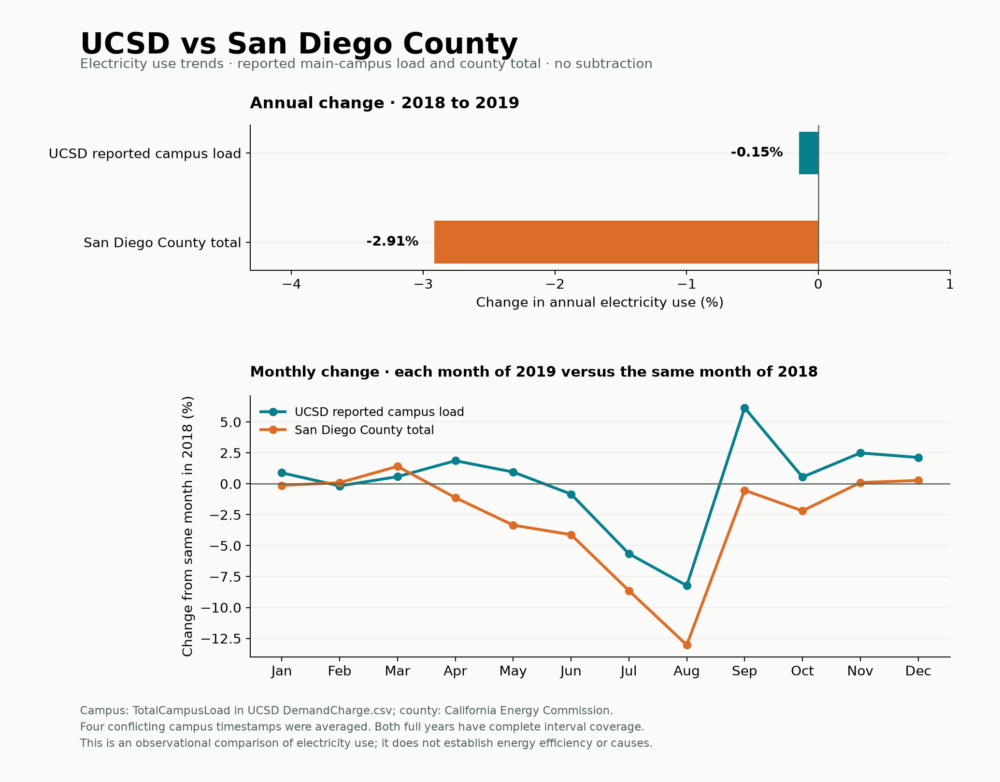

# UCSD electricity use in regional context

A Python analysis comparing changes in reported UCSD campus electricity
consumption with San Diego County between **2018 and 2019**, using public
CSV and Excel data, pandas, and Matplotlib.



## Findings

| Series | 2018 (MWh) | 2019 (MWh) | Change |
| --- | ---: | ---: | ---: |
| Reported UCSD campus load | 302,441.45 | 301,993.70 | −0.15% |
| San Diego County | 19,333,502.90 | 18,769,964.48 | −2.91% |

Campus consumption was nearly unchanged while county consumption declined more.
The difference is **2.77 percentage points**, calculated before rounding.
The lower chart compares each month of 2019 with the same month of 2018.

These changes do not establish energy efficiency or explain their causes.
Weather, occupancy, campus growth, and prior efficiency improvements could affect
results. Further analysis could examine temperatures and activity or compare
energy use per square foot among similar campuses.

## Reproduce the analysis

Use Python 3.11 or newer. From this project folder:

```sh
python3 -m venv .venv
source .venv/bin/activate
python -m pip install -r requirements.txt
python analyze.py
python build_report.py
```

On Windows, activate with `.venv\Scripts\activate` instead.
Open [outputs/report.html](outputs/report.html) locally in a browser for the
standalone report. GitHub displays the chart above directly; download the HTML
to view the report. Raw data is bundled, so analysis runs offline after installing
dependencies. `python download_data.py` retrieves any missing source files.

## Processing

1. Read campus power readings and county consumption tables.
2. Resolve daylight-saving timestamps and average four conflicting campus
   timestamp pairs, preserving the original pairs for review.
3. Check that each year contains all **35,040** expected campus intervals.
4. Convert campus average kW to MWh (`kW × 0.25 / 1,000`) and county GWh to MWh
   (`GWh × 1,000`).
5. Sum energy by month and year, check county monthly sums against annual
   totals, and plot percentage changes.

The source authors already quality-controlled the demand-charge dataset. This
analysis adds validation and documented duplicate handling. The campus file
starts in January 2018, so the main comparison uses its two complete labeled years.

## Code and supporting results

- [analyze.py](analyze.py): main analysis, validation, and chart generation.
- [build_report.py](build_report.py): standalone HTML report.
- [download_data.py](download_data.py): public source downloads.
- [Annual totals](outputs/campus_annual_comparison.csv) and
  [monthly totals](outputs/campus_monthly_comparison.csv).
- [Coverage checks](outputs/campus_data_quality.csv) and
  [conflicting readings](outputs/campus_duplicate_readings.csv).
- [Methods, sources, and limitations](docs/methodology.md).

An optional [building analysis](building_analysis.py) compares Center Hall and
Music Building with the county in 2017–2019. Run `python building_analysis.py` to
regenerate its [chart](outputs/electricity_comparison.png). It is separate from
the reported campus-load series above.

## Sources

- [UCSD Microgrid Database](https://github.com/sushilsilwal3/UCSD-Microgrid-Database),
  `DemandCharge.csv`, using `DateTime` and `TotalCampusLoad`.
  [Silwal et al. (2021)](https://doi.org/10.1063/5.0038650).
- [California Energy Commission consumption files](https://www.energy.ca.gov/files/energy-consumption-data-files),
  annual and monthly county workbooks, filtered to San Diego.
  [Consumption definitions](https://www.energy.ca.gov/data-reports/energy-almanac/california-electricity-data/california-energy-consumption-dashboards-0).

The bundled snapshot was retrieved September 30, 2026 UTC. Exact download URLs
and SHA-256 fingerprints are in [data/source_manifest.json](data/source_manifest.json).
Live source files may change. Third-party data retains its original attribution
and any applicable source terms.
